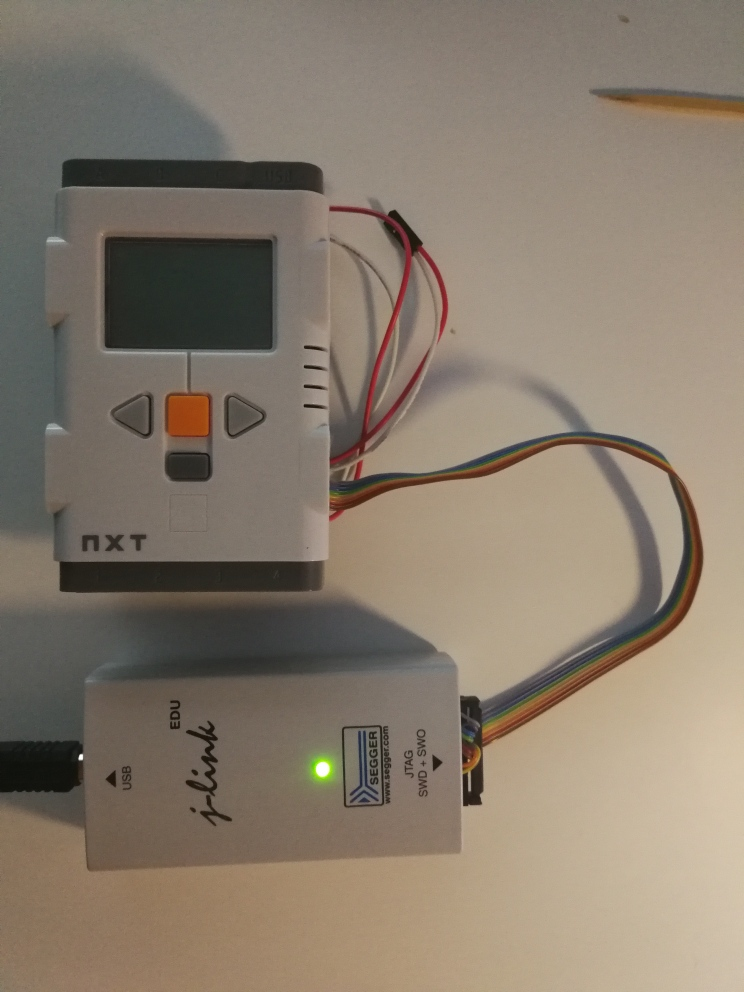
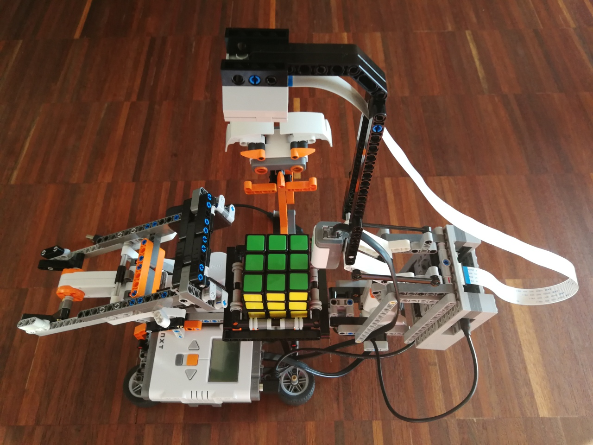

# About

HIGHLY WORK-IN-PROGRESS, CODE NOT COMPLETELY WORKING YET AND MAY NOT BUILD.

Lego Mindstorms NXT2 (ARM7-TDMI, AT91SAM7S, 64 kB RAM, bare-metal) C/C++ FW communicating with Raspberry Pi Zero 2 W
(ARM Cortex-A53, 512 MB RAM, Cortex-A53, Debian Linux 10/11) C++/Python SW.

Unfortunately I only have Lego NXT2s and don't want to buy a new EV3 set (the NXT2 was phased out several years ago). 
However, ARM low-level programming is more fun for me. So I experiment with own bare-metal firmware on the NXT (for
sensor/actuator servicing) and control software on the Raspberry Pi (for the algorithms).

Long-term goal: Raspberry Pi4 (or: Pi 3, Pi Zero 2 W) solving a Rubik's cube via Python/OpenCV and then controlling 
the NXT to physically solve it.

## Credits

The FW is partly inspired by the LeJos project (especially the AVR support code and the I2C driver code initially 
based on the code from there).

*TODO* License?

# Prerequisites

I'm using CachyOS and Ubuntu 24.04 as development platform and a RasPi Zero 2 W (or RasPi 4+5) as the computer controlling
the NXT2.

The embedded cross-build environment can be caught via Docker image below.

## Build Requirements (e.g. on Ubuntu 24.04)

Install host build environment

````
sudo apt install git cmake gcc g++ gdb-multiarch
````

Install required libraries

````
sudo apt install python3-dev
sudo apt install python3-pybind11
sudo apt install libncurses5-dev
sudo apt install libusb-1.0-0-dev
````

## Runtime Requirements (e.g. on Raspberry OS or Ubuntu 24.04)

Install required libraries

````
sudo apt install python3
sudo apt install libusb-1.0-0
````

# Build

## Docker for cross building

### Install Docker

Run install:

````
sudo apt install docker.io
````

Setup privileges for socket:

````
sudo usermod -aG docker $USER
````

### Build Image

Run setup script:

````
docker build --tag rpi-nxt2 .
````

### Run Image

Run the container:

````
docker run --user $(id -u):$(id -g) -it -v $(pwd)/../../..:/workspace rpi-nxt2:latest
````

To re-run after exit:

````
docker start rpi-nxt2 -i
````

### Build ARM7-TDMI Firmware

Run (in container):

````
cd /workspace
./build_nxt.sh <build_type> <app_name>
````

where `app_name` is the app added to `nxt/apps`.

e.g.

````
cd /workspace
./build_nxt.sh debug status
````

### Build Linux Software

Run:

````
cd /workspace
./build_linux.sh <build_type>
````

````
cd /workspace
./build_nxt.sh debug
````

# Flashing

## Flashing the NXT FW

### Install Atmel SAM-BA

SAM-BA is a flash programmer formerly developed by Atmel (from where the AT91S silicon was originally coming).

The SAM-BA flash programmer can be downloaded from MICROCHIP: 
https://www.microchip.com/en-us/development-tool/SAM-BA-IN-SYSTEM-PROGRAMMER#

Unpack it and set a soft-link for `sam-ba_64`:

````
sudo ln -s /opt/atmel/sam-ba/sam-ba_64 /usr/local/bin/sam-ba
````

### Run Flash Tool

Bring the NXT into flash mode and connect it to USB or JTAG, then:

````
tools/sam-ba.sh
````

# Running

## Starting the NXT

To start the NXT, just insert the batteries, and it will boot. You should see the title according to your selected
application (see `<app_name>` above).

## Starting the Linux SW

### USB Connection Console

There is only the USB connection monitoring console tool available yet:

````
build/linux/nxt_console/nxt_console
````

You need to apply the USB permissions rules in the `config/taspi/udev/rules.d` directory to get it running.

````
sudo cp config/raspi/udev/rules.d/70-nxt-usb-permissions.rules /etc/udev/rules.d
sudo udevadm control --reload-rules
sudo udevadm trigger
````


# Debugging

For debugging on the NXT I use the SEGGER J-Link ICE (EDU version). For that I soldered pins of the NXT board to expose
the JTAG interface. Via adapter, I then connect the ICE to the NXT.



## Debugging the NXT FW

### Install J-Link

The Debian package can be downloaded from SEGGER: https://www.segger.com/downloads/jlink.

Set soft-link for `JLinkGDBServerCLExe`:

````
sudo ln -s /opt/segger/jlink/JLinkGDBServerCLExe /usr/local/bin/jlink-gdbserver
````

### Run GDB Server

Connect the JTAG connector to the J-Link ICE and run:

````
tools/jlink/jlink_gdbserver.sh
````

### Attach to GDB Server

This is tools specific. I use CLion which controls the GDB. Use the host-stools GDB script `tools/gdb/host_init.gdb`.

## Debugging the Linux SW

This is a trivial process and well-documented for your tools.

# Examples

## Linux Examples

### Python API Demo

See [linux/examples/python/hello_world](linux/examples/python/hello_world).

### Minimal NXT Remote Console

See [linux/examples/python/nxt_console](linux/examples/python/nxt_console).

### Cube Solver

See [linux/examples/python/cube_solver](linux/examples/python/cube_solver).



