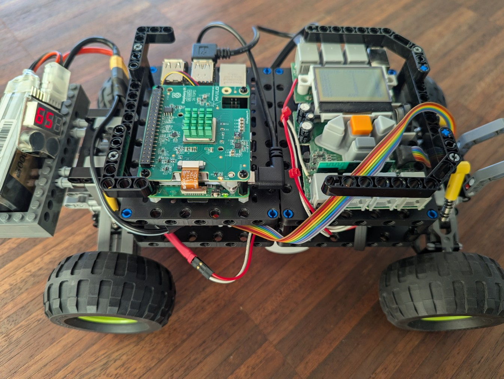

# About

Lego Mindstorms NXT2 (ARM7-TDMI, AT91SAM7S, 64 kB RAM, bare-metal) C/C++ firmware communicating with a Raspberry Pi
runnig C++ and/or Python bindings (will also be available for ROS 2.0).

Unfortunately I only have several Lego NXT2s (the NXT 2.0 was phased out a lot of years ago). However, ARM low-level
programming is fun for me. So I experiment with own bare-metal firmware on the NXT (for sensor/actuator servicing)
and control software on the Raspberry Pi (for the algorithms).

Achieved goal: Raspberry Pi4/5 (or: Pi Zero 2W) solving a Rubik's cube via Python/OpenCV and then controlling
the NXT to physically solve it (see below).

Long-term goal: Raspberry Pi5 with PCIe3 and Halo-8 AI hat robot car navigating based on Pi camera stream. For that
I will create some ROS2 serives and messages to controly and query the NXT2 sensors and actuators.

**Note:** I've added app support in the firmware because formerly also the control software was running on the NXT. So there is still a split possible and not all software needs to run on the Raspberry Pi.

## Credits

The FW is partly inspired by the LeJos project (especially the AVR support code and the I2C driver code initially 
based on the code from there, other parts were rewritten or written from scratch).

*TODO* License?

# Prerequisites

I'm using CachyOS and Ubuntu 24.04 as development platform and a Raspi 5 (or RasPi 4 or  RasPi Zero 2 W) as the
computer controlling the NXT2.

The embedded cross-build environment can be caught via Docker image below.

## Build Requirements (e.g. on Ubuntu 24.04)

Install host build environment

````sh
sudo apt install git cmake gcc g++ gdb-multiarch
````

Install required libraries

````sh
sudo apt install python3-dev python3-pybind11
sudo apt install libncurses5-dev libusb-1.0-0-dev
````

## Runtime Requirements (e.g. on Raspberry OS or Ubuntu 24.04)

Install required libraries

````sh
sudo apt install python3
sudo apt install libusb-1.0-0
````

## Optional Requirements (e.g. on Ubuntu 24.04)

Install host development environment:

````sh
sudo apt install clang-format clangd
````

For building ROS2 drivers install:

````sh
sudo apt install colcon vcstool
````

And in the Python virtual environment

````sh
pip install catkin_pkg ament-package empy lark
````

For a full ROS2 setup on Raspberry Pi refere to [ROS2 configuration](./config/raspi/ros2/README.md).

# Build

## Docker for cross building

### Install Docker

Run install:

````sh
sudo apt install docker.io
````

Setup privileges for socket:

````sh
sudo usermod -aG docker $USER
````

### Build Image

Run setup script:

````sh
docker build --tag rpi-nxt2 .
````

### Run Image

Run the container:

````sh
docker run --user $(id -u):$(id -g) -it -v $(pwd)/../../..:/workspace rpi-nxt2:latest
````

To re-run after exit:

````sh
docker start rpi-nxt2 -i
````

### Build ARM7-TDMI Firmware

Run (in container):

````sh
cd /workspace
./build_nxt.sh <build_type> <app_name>
````

where `app_name` is the app added to `nxt/apps`.

e.g.

````sh
cd /workspace
./build_nxt.sh debug status
````

### Build Linux Software

Run:

````sh
cd /workspace
./build_linux.sh <build_type>
````

````sh
cd /workspace
./build_nxt.sh debug
````

# Flashing

## Flashing the NXT FW

### Install Atmel SAM-BA

SAM-BA is a flash programmer formerly developed by Atmel (from where the AT91S silicon was originally coming).

The SAM-BA flash programmer can be downloaded from MICROCHIP: 
https://www.microchip.com/en-us/development-tool/SAM-BA-IN-SYSTEM-PROGRAMMER#

Unpack it and set a soft-link for `sam-ba_64`:

````sh
sudo ln -s /opt/atmel/sam-ba/sam-ba_64 /usr/local/bin/sam-ba
````

### Run Flash Tool

Bring the NXT into flash mode and connect it to USB or JTAG, then:

````sh
tools/sam-ba.sh
````

or just

````sh
sam-ba /dev/ttyACM0 at91sam7s256-ek
````

# Running

## Starting the NXT

To start the NXT, just insert the batteries, and it will boot. You should see the title according to your selected
application (see `<app_name>` above).

## Starting the Linux SW

### USB Connection Console

There is only the USB connection monitoring console tool available yet:

````sh
build/linux/nxt_console/nxt_console
````

You need to apply the USB permissions rules in the `config/taspi/udev/rules.d` directory to get it running.

````sh
sudo usermod -a -G dialout $USER
sudo cp config/raspi/udev/rules.d/70-nxt-usb-permissions.rules /etc/udev/rules.d
sudo udevadm control --reload-rules
sudo udevadm trigger
````

Note: Use group `uucp` in the file if on Arch like me.

# Debugging

For debugging on the NXT I use the SEGGER J-Link ICE (EDU version). For that I soldered pins of the NXT board to expose
the JTAG interface. Via adapter, I then connect the ICE to the NXT.


## Debugging the NXT FW

### Install J-Link

The Debian package can be downloaded from SEGGER: https://www.segger.com/downloads/jlink.

Set soft-link for `JLinkGDBServerCLExe`:

````sh
sudo ln -s /opt/segger/jlink/JLinkGDBServerCLExe /usr/local/bin/jlink-gdbserver
````

### Run GDB Server

Connect the JTAG connector to the J-Link ICE and run:

````sh
tools/jlink/jlink_gdbserver.sh
````

### Attach to GDB Server

This is tools specific. I use CLion which controls the GDB. Use the host-stools GDB script `tools/gdb/host_init.gdb`.

## Debugging the Linux SW

This is a trivial process and well-documented for your tools.

# Examples

## Python Examples

### Python API Demo

See [hello_world](src/host/python/apps/hello_world).

### Minimal NXT Remote Console

See [nxt_console](src/host/python/apps/nxt_console).

### Cube Solver

See [cube_solver](src/host/python/apps/cube_solver).


# ROS

## Driver Node

See [linux/examples/python/nxt_console](src/ros2/nxt_drivers/README.md).

## Robot Car


