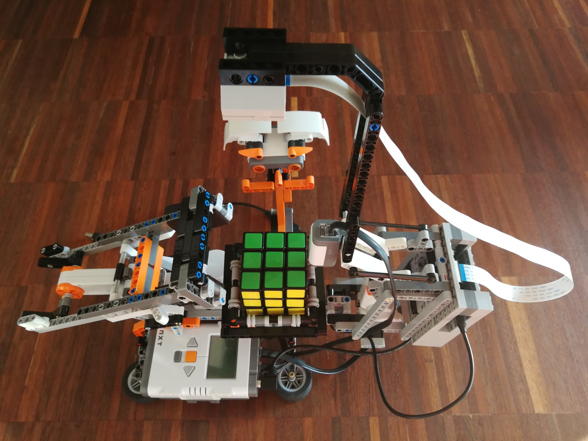

# Python Rubik's Cube Solver

This Python application will use my NXT remote control library with its Python binding `nxt_remote_py` to control the
Lego model gathered from the MindCuber page (see http://mindcuber.com/).



Console only, no graphical subsystem required on the PI!

## Structure

The example consists of:

- a machine representation class `SolverMachine`
- a cube detector class `ColorDetector`
- a console view class `SolverConsole` that can be used via SSH
- video utility classes (camera, stream receiver, stream sender, ...)
- general utility classes (periodic timer, console window)

## Debugging

### Video Streaming

The image detection can be viewed remotely via the class `VideoReceiver`. 

### Video Streaming plus Color Range Adjustment

For proper calibration, the class `ColorRanger` can also receive the image in order to be able to adapt the color
ranges.

## Deployment

Put Python module into the `PYTHONPATH`, e.g. when the binaries are deployed via CMake into `~/.local/lib`, like 
assumed in [pi_setup.sh](../../../../scripts/pi_setup.sh):

````
export PYTHONPATH=$SOURCE_DIR/linux/libs/python:$HOME/.local/lib
````

